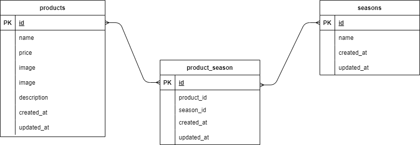

# プロジェクト名: もぎたて Laravel

## Mogitate-Laravel セットアップ手順

## 概要
このプロジェクトは、Laravelを使用したテストプロジェクト「Mogitate-Laravel」です。Dockerを利用して効率的かつ再現性の高い開発環境を構築します。

## 環境情報
- **OS**: Windows 11  
- **WSL**: WSL2  
- **Docker**: 27.4.0  
- **Docker Compose**: 2.31.0 Desktop.2  
- **PHP**: 7.4.9  
- **Composer**: 2.8.4  
- **MySQL**: 8.0.26  
- **Laravel Framework**: 8.83.29

## セットアップ手順

### 1. 必要なツールのインストール
以下のツールがインストールされていない場合は、公式サイトからインストールしてください。

- [WSL2](https://docs.microsoft.com/en-us/windows/wsl/install)
- [Docker Desktop](https://www.docker.com/products/docker-desktop)
- [Composer](https://getcomposer.org/)

### 2. プロジェクトのクローン
アプリケーションを作成するために、coachtechのカリキュラムで使用したTodoアプリの開発環境を GitHub からクローンします。
laravel-docker-template.gitをクローンしてリポジトリ名をmogitate-laravelに変更します。

```bash
$ git clone git@github.com:coachtech-material/laravel-docker-template.git
$ mv laravel-docker-template mogitate-laravel
```
GitHub にて個人のリモートリポジトリの url を変更します。
mogitate-laravelという変更先のリモートリポジトリをpublicで作成します。

変更先のリポジトリの作成が終わったら、ローカルリポジトリから紐付け先を変更します。
Set up Desktop or sshを選択し、git@github.com:user name/mogitate-laravel.gitをコピーし、「作成したリポジトリのurl」と記述されている以下の部分にペーストする

```bash
$ cd mogitate-laravel
$ git remote set-url origin 作成したリポジトリのurl
$ git remote -v
```
変更先の url が表示されれば成功です。

次に、現在のローカルリポジトリのデータをリモートリポジトリに反映させます。
```bash
$ git add .
$ git commit -m "リモートリポジトリの変更"
$ git push origin main
```
作成したリポジトリに変更が反映されていたら成功です。


### 3. Dockerコンテナのセットアップ
プロジェクト内でDockerコンテナを構築します。

```bash
$ docker-compose up -d
```
このコマンドは、必要なDockerコンテナ（MySQL、PHP、Laravel用のサービスなど）をバックグラウンドで立ち上げます。

### 4. Composer依存関係のインストール
Laravelの依存関係をインストールするために、コンテナ内でComposerを使用します。

```bash
$ docker-compose exec app composer install
```
これで、Laravelプロジェクトの依存関係がインストールされます。

### 5. 環境設定
`.env` ファイルを作成（まだ作成されていない場合）します。`env.example` ファイルをコピーして `.env` を作成します。

```bash
$ cp .env.example .env
```

その後、`.env` ファイルを編集し、MySQLの設定を行います。

```env
DB_CONNECTION=mysql
DB_HOST=mysql ← Dockerコンテナ内のサービス名に合わせる
DB_PORT=3306
DB_DATABASE=laravel_db ←必要に応じて変更
DB_USERNAME=laravel_user ←必要に応じて変更
DB_PASSWORD=laravel_pass ←必要に応じて変更
```

### 6. アプリケーションキーの生成
Laravelのアプリケーションキーを生成します。

```bash
$ docker-compose exec app php artisan key:generate
```

### 7. マイグレーションの実行
データベースのマイグレーションを実行します。

```bash
$ docker-compose exec app php artisan migrate
```

これで、必要なテーブルがデータベースに作成されます。

### 8. アクセス確認
セットアップが完了したら、ブラウザで以下のURLにアクセスして、Laravelアプリケーションが正しく動作することを確認します。

```
http://localhost
```
### 最期に
※開発環境によって不要なファイルが含まれています、自己判断で削除してください。


## ER図


---
